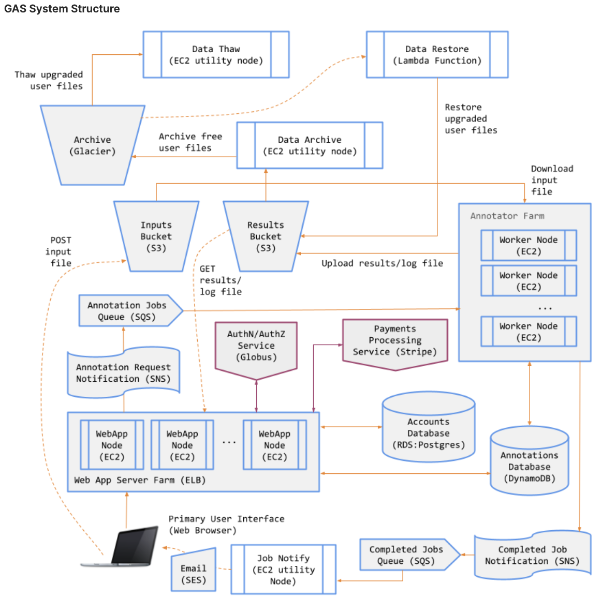
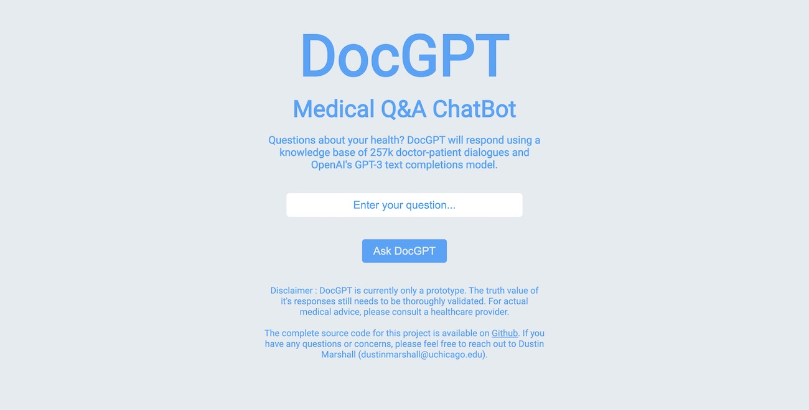
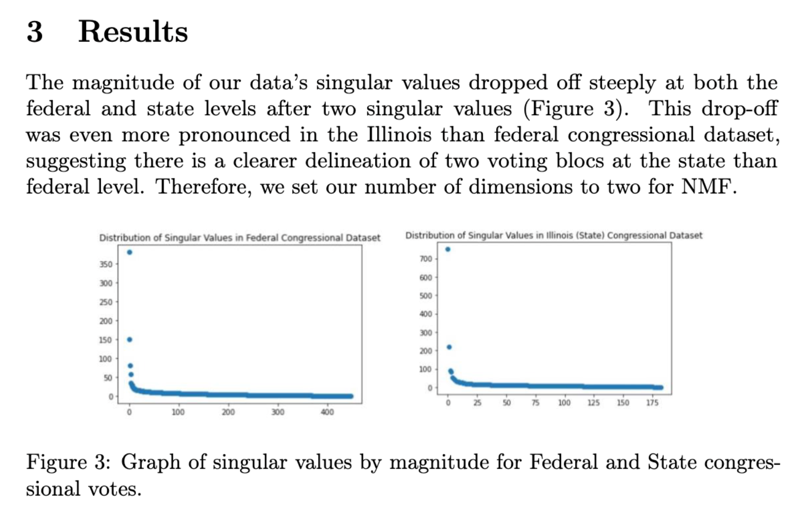
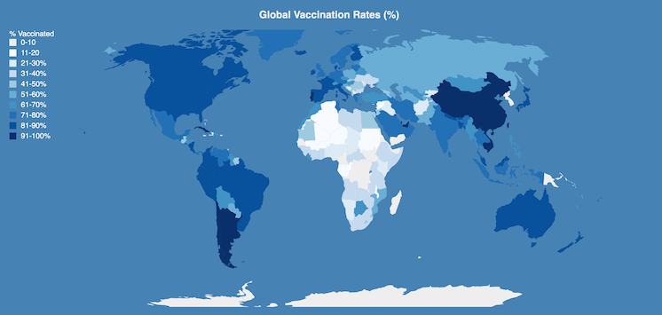
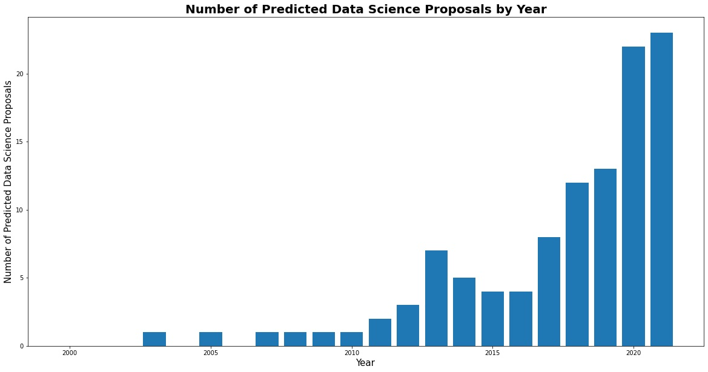
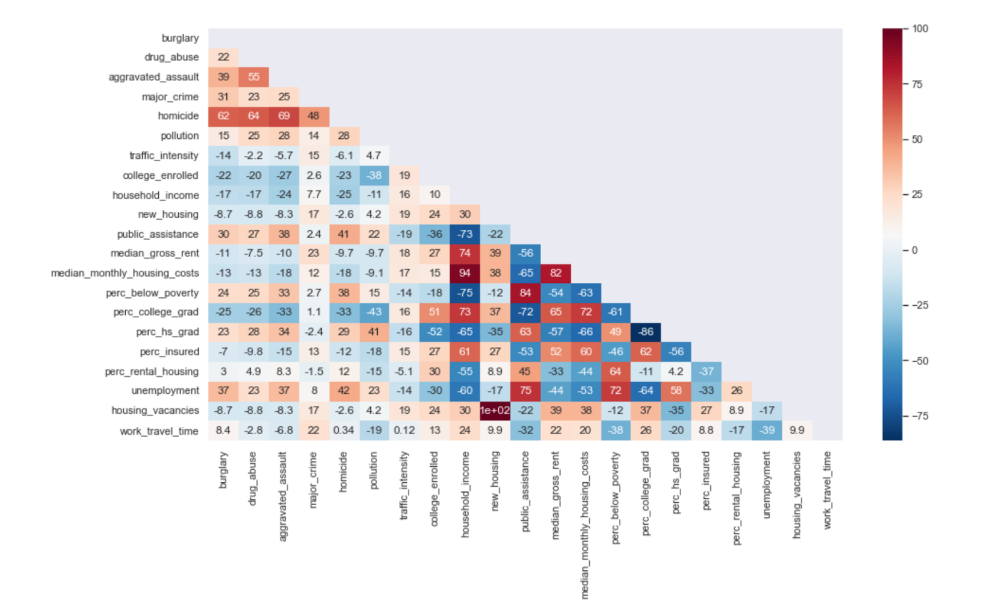
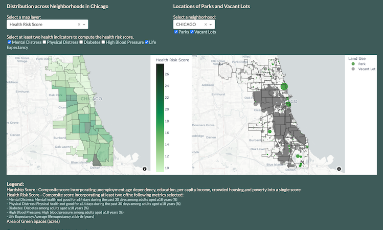

## Project Portfolio

---
## Genomic Annotation Service Application
### Cloud Computing & Software Engineering Code Sample
During a <a href="https://mpcs-courses.cs.uchicago.edu/2022-23/spring/courses/mpcs-51083-2#:~:text=This%20course%20provides%20an%20introduction,on%2Dpremises%20and%20cloud%20infrastructure.">Cloud Computing course</a> in UChicago's Computer Science Department in Spring 2023, I built a custom cloud application with AWS. I used a custom Flask API, EC2 instances for frontend, backend, and utility services, S3 object storage buckets for inputs and outputs, a DynamoDB database for storing user and job data, Lambda functions for maintaining serverless scalable workflows, and SNS messages + SQS queues for communicating between the distributed systems. The Github repo for this project is private, but I've made the exported code available <a href="https://drive.google.com/file/d/1OJ5KSlXKvHIr8I5Tw-sYudv_NDYaP3Jb/view">here</a>.

---
## Medical AI Chatbot Application
### Software Engineering & Data Analysis Code Sample + Academic Writing Sample
During a <a href="https://harris.uchicago.edu/academics/programs-degrees/courses/big-data-and-development-winter-2023">Big Data and Development course</a> for UChicago's MSc in Computational Analysis and Public Policy in Winter 2023, I coded and deployed a cloud-based <a href="https://docgpt.herokuapp.com/">medical AI chatbot</a> using OpenAI’s Completions and Embeddings API endpoints. I used prompt engineering and text embeddings drawn from a knowledge base of 257k doctor-patient dialogues to improve model response. I wrote an accompanying <a href="https://github.com/dustinmarshall/DocGPT/blob/main/research_design.pdf">research design</a> for a health intervention using the app. The application is fully open-source on <a href="https://github.com/dustinmarshall/DocGPT">GitHub</a>.

---
## Using Singular Value Decomposition to Detect Partisan Voting
### Machine Learning & Data Analysis Code Sample + Academic Writing Sample
During a <a href="https://willett.psd.uchicago.edu/teaching/mathematical-foundations-of-machine-learning-fall-2021/">Mathematical Foundations of Machine Learning course</a> in UChicago's Computer Science Department in Fall 2022, I co-authored an ML analysis of federal and state voting records. We used singular value decomposition and non-negative matrix factorization to detect partisanship in voting behavior, finding two clear voting blocs at both the national and state level that align with party affiliation. The <a href="https://github.com/dustinmarshall/detecting_partisan_voting_using_SVD/blob/main/detecting_partisanship_using_SVD.ipynb">code</a> and accompanying <a href="https://github.com/dustinmarshall/detecting_partisan_voting_using_SVD/blob/main/detecting_partisanship_using_SVD.pdf">academic paper</a> are available on GitHub.

---
## D3 Visualization for Vaccine Hesitency Chatbot Intervention 
### Data Visualization & Javascript Code Sample
During a Data Visualization course for UChicago's MSc in Computational Analysis and Public Policy in Fall 2022, I created a data vizialization in D3.js using the preliminary results of an ongoing <a href="https://osf.io/mgyxu/">chatbot intervention</a> to improve vaccine acceptance in Kenya and Nigeria with Prof. Molly Offer-Westort and DIL Director Leah Rosenzweig. The visualization is coded using the JavaScript library D3.js, which is used to produce dynamic, interactive data visualizations in web browsers. It includes a chloropleth map, grouped bar charts, and heatmaps. The code is available on <a href="https://github.com/dustinmarshall/data_visualization_for_policy_analysis/tree/main/final_project">GitHub</a>.

---
## Text Classification Model to Improve Grantee Discovery
### Machine Learning & Data Analysis Code Sample + Blog Writing Sample
During an internship with the Rockefeller Foundation's Data Science team in Summer 2022, I worked on a project mapping the non-profit space with natural language processing and machine learning. I built a subject classification model to classify their corpus of grant proposals to aid grantee discovery. The model is open-source on <a href="https://github.com/dustinmarshall/data_science_subject_classifier">GitHub</a> and a <a href="https://medium.com/mlearning-ai/using-nlp-to-improve-grantee-discovery-adc40f3833f">blog post</a> detailing the process was published on a popular machine learning blog on Medium.

---
## Predicting Gentrification using Tract-level Characteristics
### Data Visualization & Machine Learning Code Sample
During a Machine Learning course for UChicago's MSc in Computational Analysis and Public Policy in Spring 2022, my group used 2016 census tract data of neighborhood characteristics to predict a binary classification of a neighborhood’s gentrification status in 2019. The dataset contained 778 census tracts with 22 feature variables measuring socioeconomic status, educational attainment, criminal activity, pollution level, transportation equity and housing equity. The annalysis compared the F1-score performance of logistic regression, decision tree, random forest, and gradient-boosted decision tree models. The code and final report are available on <a href="https://github.com/dustinmarshall/predicting_gentrification_using-ML">GitHub</a>.

---
## Interactive Dashboard Mapping Parks and Underutilized Public Land
### Data Visualization & Geospatial Analysis Code Sample
During a Computer Science course for UChicago's MSc in Computational Analysis and Public Policy in Winter 2022, my group coded a data visualization interface in Dash. The interface serves as a tool for urban planners to identify neighborhoods with disproportionately few green spaces and many vacant lots to be considered for conversion. My contribution focused on collecting, cleaning, and wrangling the data on green spaces and vacant lots using the City of Chicago and Cook County's APIs. The code and written report are available on <a href="https://github.com/dustinmarshall/less-vacant-places-more-green-spaces">GitHub</a>.

