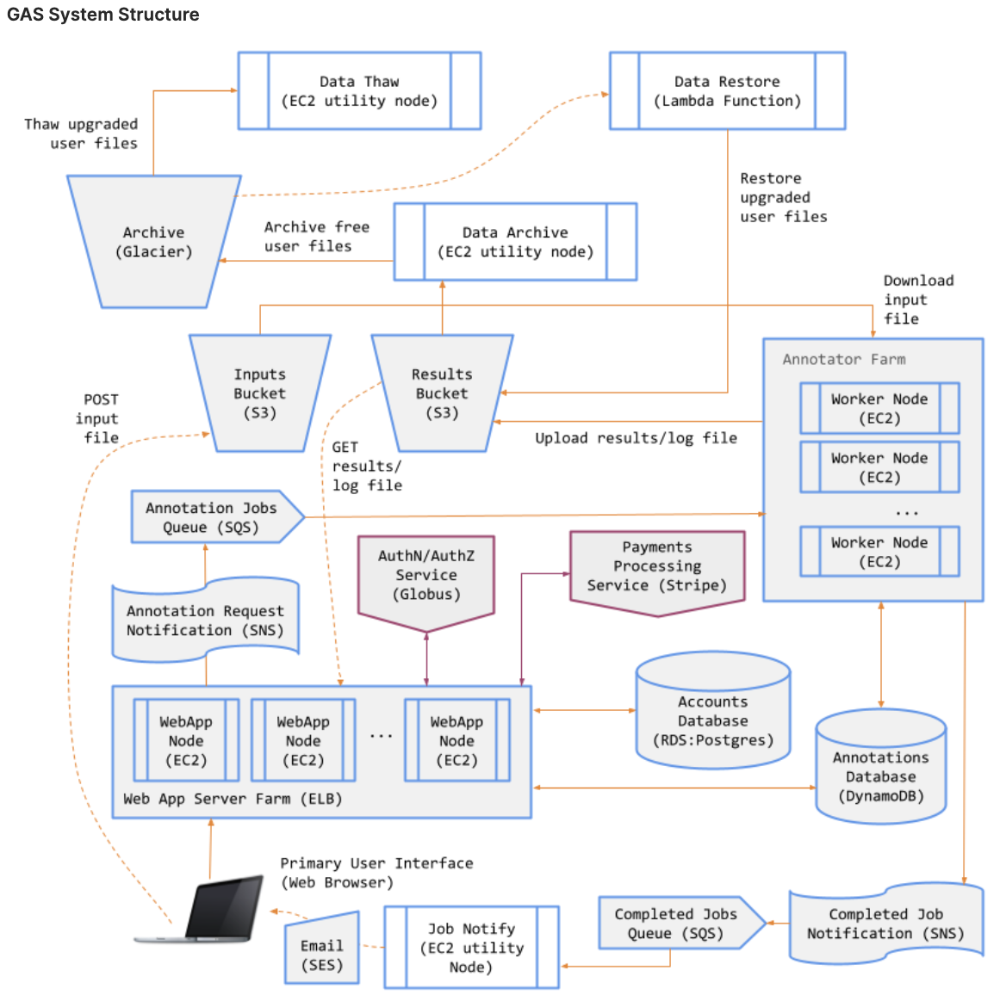
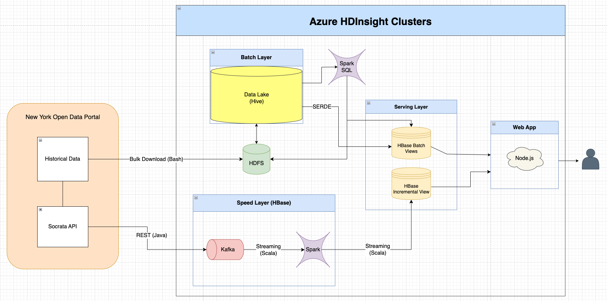
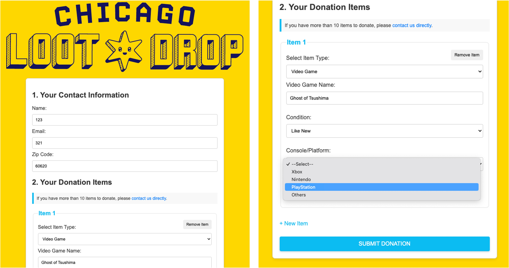
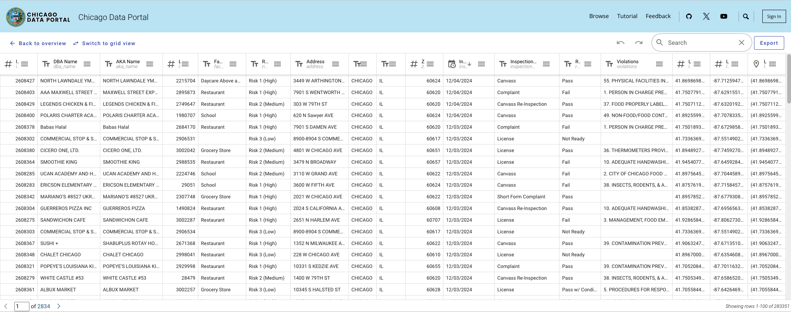
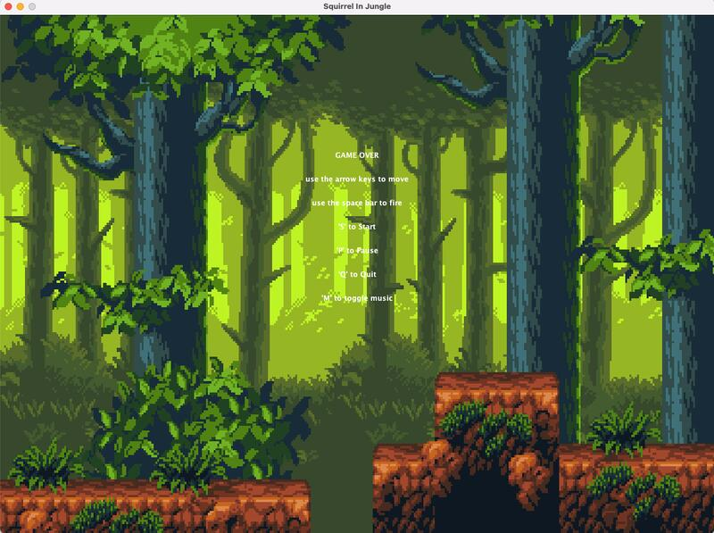
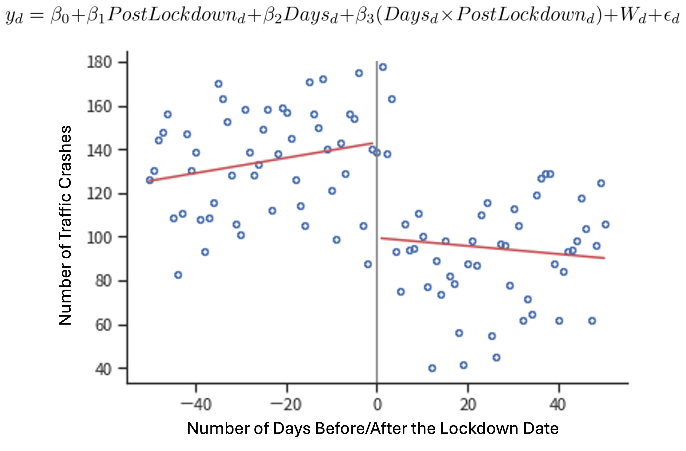
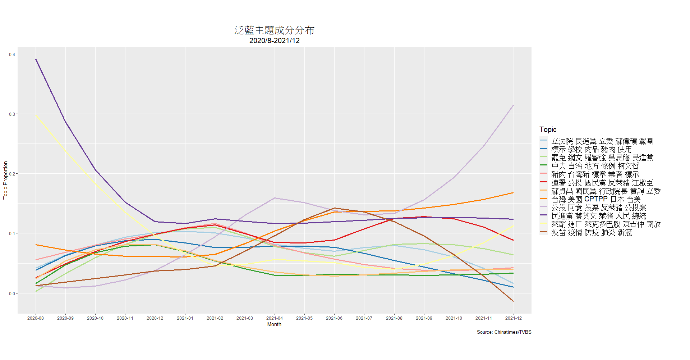

## Project Portfolio

---
## Scalable Genomic Annotation Service System with AWS
### Cloud Computing & Software Engineering

During UChicago's <a href="https://mpcs-courses.cs.uchicago.edu/2024-25/autumn/courses/mpcs-51083-1">Cloud Computing course</a> in Autumn 2024, I developed the Genomics Annotation Service (GAS)—a scalable, fault-tolerant, and cost-effective system designed to efficiently manage asynchronous workflows in a distributed cloud environment. The system decouples communication between the web server frontend from the annotation backend, allowing the web application to publish job requests asynchronously so that each component is capable of independent scaling and fault isolation.

For the frontend, an Application Load Balancer distributes HTTPS traffic across multiple EC2 instances in an **Auto Scaling group**, ensuring high availability and efficient resource utilization. The Auto Scaling group, configured with a minimum of two instances and a maximum of ten, provides elasticity to handle varying job requests from users while maintaining a baseline capacity for consistent performance.

On the backend, the annotation service is similarly designed for scalability and timely job processing. The annotators utilize polling mechanism and <a href="https://www.redhat.com/en/topics/automation/what-is-a-webhook">webhook pattern</a> along with Amazon **SNS and SQS**, with the latter requiring its own load balancer and auto scaling group respond to the depth of SQS (#number of pending annotation jobs).

The system incorporates several reliability features, including health checks for instances and automated instance replacement. Error budgets are implicitly managed through the auto scaling policies, which maintain a minimum number of two healthy instances. Observability is addressed through AWS's built-in **CloudWatch**, allowing for tracking of key metrics such as instance health, request counts, and latency.

The architecture leverages **Amazon S3** for storing input annotation files, results, and logs, while **DynamoDB** ensures persistent storage of job metadata and user interaction. To enhance scalability and reliability, I implemented asynchronous inter-process communication and serverless workflows for various system functions. For data archival and restoration, I created serverless workflows using **AWS Step Functions and Lambda** that integrated with <a href="https://docs.stripe.com/api">Stripe’s payment API</a>, facilitating efficient lifecycle management between **S3 and Glacier** based on user tiers, including users' account data and uploaded files.

For more detailed introduction, please watch my <a href="https://youtu.be/gnoWB4kkvcg">demo video</a>. The comprehensive code for this project is private (in accordance with University policy), but I've made the exported code available <a href="https://github.com/jycc-267/Scalable-Genomic-Annotation-Service">here</a>. If you are interested in my work, please <a href="mailto:jycc267@gmail.com">contact me</a>!

---
## End-to-End Lambda Architecture for Ad Hoc Reporting on Large-Scale Uber Trip Data
### Big Data Processing & Full-Stack Development

This project implements a <a href="https://www.snowflake.com/guides/lambda-architecture/">Lambda Architecture</a> to analyze <a href="https://www.nyc.gov/site/tlc/about/tlc-trip-record-data.page">high-volume for-hire vehicle (HVFHV)</a> trips in New York City using Azure HDInsight Clusters. The architecture combines batch processing of large datasets with real-time analysis, providing hourly insights into key metrics of trip efficiency and pricing dynamics for major ride-sharing services. Metrics such as average price, wait time, trip duration, and costs related to tolls and congestion surcharges are analyzed and broken down by carrier, pickup location, dropoff location, and hour of the day. A Node.js web application serves as the front-end, enabling users to interact with the processed data and generate ad hoc reports.

The system is structured into three main layers:
1. **Batch Layer**: Processes historical data stored in **HDFS** and **Hive**, enabling comprehensive analysis of past trends.
2. **Serving Layer**: Combines batch views from **HBase** with incremental views to support efficient ad hoc querying.
3. **Speed Layer**: Handles real-time data processing using **Kafka** and **Spark Streaming**, ensuring up-to-date insights.

Data is sourced from <a href="https://data.cityofnewyork.us/Transportation/2022-High-Volume-FHV-Trip-Records/g6pj-fsah/about_data">the New York Open Data Portal</a>, with historical datasets bulk downloaded and real-time data fetched via the <a href="https://dev.socrata.com/foundry/data.cityofnewyork.us/g6pj-fsah">Socrata API</a>. This architecture delivers a scalable, fault-tolerant system that seamlessly integrates batch and real-time analytics, empowering users with actionable insights into New York City's ride-sharing ecosystem. The application is fully open-source on <a href="https://github.com/jycc-267/big-data-hvfhv-uber">GitHub</a>, and <a href="https://youtu.be/pzD_eoVlbF0">the demo video</a> is available on youtube.

---
## Data Modeling and CRM System Design for Nonprofit Donation Management
### Data Modeling & User Interface Research

As a data engineer at <a href="https://www.uchicagotechteam.com/current-projects">UChicago TechTeam</a>, I developed a comprehensive CRM database solution on Azure for Chicago Loot Drop, a non-profit organization supporting the gaming community. The project focused on streamlining data management for their game donation program by redesigning the CRM database schema and conducting user research to create an intuitive front-end data input interface.

The core of the project involved data modeling of the CRM system to efficiently collect and manage client data. This included creating a centralized database to store information about donor organizations, donated items, type of games, controllers/consoles, and recipients. The solution not only improved data management efficiency but also enhanced the organization's ability to track donations and manage relationships with donors and recipients effectively.

The Github repo for this project is private, but the front-end prototype made by my co-workers is available <a href="https://codepen.io/Yuxin-Ji/pen/rNbQMXM">here</a>.

---
## Backend Data Access Layer Management for Restaurant Inspection Query Endpoints 
### Database Management & Data Deduplication

During UChicago's Database course in Spring 2024, I designed and developed a backend system to manage <a href="https://data.cityofchicago.org/Health-Human-Services/Food-Inspections/4ijn-s7e5/about_data">Chicago restaurant inspection data</a> using Flask-based RESTful APIs. I built endpoints to efficiently handle write/update (POST) and read (GET) operations, ensuring seamless data retrieval and updates. The system utilized an SQLite3 database, where I implemented dynamic batching and transaction control mechanisms, boosting query consistency and data integrity by 30%. These enhancements ensured atomicity in bulk operations, minimizing partial updates and data corruption.

To address data redundancy and improve quality, I engineered a deduplication process leveraging advanced string similarity algorithms for record linkage, reducing error entries by 40%. I further optimized the process by implementing blocking and indexing techniques, significantly accelerating data cleaning algorithms. Additionally, the database was enhanced to support record linkage between restaurants and external tweet data, combining geospatial and text-matching techniques to provide comprehensive insights into restaurant-related activity.

These efforts culminated in a robust, scalable, and clean backend data access layer capable of supporting real-time query endpoints. The code is available on <a href="https://github.com/jycc-267/Chicago-Restaurant-Inspection">GitHub</a>.

---
## Multi-threaded, arcade-style 2D Java Game Development
### Object-oriented Programming & GUI Programming

This project demonstrates a sophisticated 2D game engine built using object-oriented programming principles and multi-threading techniques. The Game class serves as the central controller, managing the game's core logic and state. It implements a robust game loop that handles sprite lifecycle, collision detection, and movement control with precision timing.

The engine utilizes a multi-threaded approach, separating the animation thread from the main event dispatch thread to ensure smooth gameplay. It employs a deferred mutation strategy for game object management, processing additions and removals after collision detection to maintain data integrity. The system also features dynamic level progression, spawning enemies based on the current level, and implements various game mechanics such as power-ups, different weapons, and boss encounters. Sound management and user input handling are integrated seamlessly, providing a comprehensive framework for an interactive gaming experience.

The game is open-source on <a href="https://github.com/jycc-267/My2DGame">GitHub</a>.

---
## Impact Evaluation of Covid-19 Precautions on Traffic Accidents
### Panel Data Analysis & Regression Discontinuity

This study examined the impact of COVID-19 Lockdown on traffic accidents in Taoyuan City, Taiwan, using regression discontinuity design and time fixed effects (<a href="https://bashtage.github.io/linearmodels/panel/panel/linearmodels.panel.model.PanelOLS.html">Python PanelOLS</a>). The research found that after implementing the Lockdown, Taoyuan City experienced a significant decrease in daily traffic accidents, with an average reduction of 43 incidents per day. However, the proportion of speeding cases among all traffic accidents increased significantly. The study also revealed interesting changes in the types of vehicles involved in accidents: the proportion of accidents involving passenger cars decreased by 3.76%, while accidents involving motorcycles increased by 3.29%. This shift was attributed to the rise of food delivery services during the pandemic.

Other notable findings include a decrease in accidents occurring at intersections and an increase in accidents in the middle of road sections, possibly related to the rise in speeding incidents. The study found no significant changes in fatal accidents or in the time taken for police to arrive at accident scenes. Additionally, accidents involving drivers under 65 years old decreased significantly, while there was no significant change for those over 65.

The results show that while overall accident numbers decreased, certain types of dangerous driving behaviors (such as speeding) may have increased. This provides a basis for developing more targeted traffic safety policies, especially during similar public health emergencies. The code and final report (Chinese) are available on <a href="https://github.com/jycc-267/Effects-of-COVID-19-Precautions-on-Traffic-Accidents-Taoyuan">GitHub</a>.

---
## NLP Analysis of Agenda Setting Behavior of Partisan Media
### Natural Language Processing & Document Clustering

This project investigated the agenda-setting behavior of partisan media in Taiwan during the 2020–2021 debate over ractopamine pork imports, focusing on four major outlets: TVBS, China Times (pan-blue); Liberty Times, and FTV (pan-green). Using natural language processing (NLP) techniques such as Word2Vec, co-occurrence analysis, and <a href="https://towardsdatascience.com/latent-dirichlet-allocation-lda-9d1cd064ffa2">Latent Dirichlet Allocation (LDA)</a>, the study classified over 9,000 news articles into ten main topics. These topics included but not limited to cross-straits relations, government authority, international relations, and public health. The analysis revealed significant differences in how pan-blue and pan-green media framed the issue to influence public perception before the 2021 referendum.

The findings highlighted a strategic advantage for pan-green media, which maintained a cohesive narrative connecting ractopamine pork to Taiwan-U.S. relations and international trade benefits. In contrast, pan-blue media exhibited fragmented messaging, failing to focus on high-impact topics like food safety and health. This disparity was reflected in the distribution of discourse resources and ultimately influenced referendum outcomes.

By combining exploratory data analysis with advanced NLP models, this project provided insights into how partisan media shape public discourse and policy outcomes through agenda-setting strategies. The code and academic paper (Chinese) are available on <a href="https://github.com/jycc-267/Ractopamine-Pork-Agenda-Setting">GitHub</a>.

